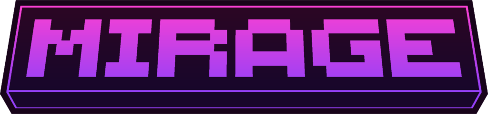

# Mirage

Mirage is a multi-platform Minecraft MOTD renderer for Paper and Minestom.

It slices an image into `8x8` tiles, uploads the generated skins through MineSkin, caches the texture payloads, and renders the result in the server list using modern player-head object components.

## Gradle

Repository:

```kotlin
repositories {
    maven("https://repo.smolder.fr/public/")
    maven("https://repo.inventivetalent.org/repository/public/") // Needed for the MineSkin client
}
```

Dependencies:

```kotlin
dependencies {
    implementation("fr.smolder:mirage-core:0.0.1")
    implementation("fr.smolder:mirage-platform-spigot:0.0.1")
    implementation("fr.smolder:mirage-platform-minestom:0.0.1")
}
```

## Modules

- `mirage-core`: platform-agnostic image slicing, cache, config, MineSkin integration, and MOTD generation
- `mirage-platform-spigot`: Paper adapter
- `mirage-platform-minestom`: Minestom adapter and manual test server

## Requirements

- Java 21 for the main project
- Java 25 for Minestom

## Configuration

Mirage loads `mirage-config.yml` from the platform data directory.

Minimal example:

```yaml
settings:
  mineskin_api_key: "YOUR_KEY_HERE"
  database_type: "sqlite"
  minimum_modern_protocol: 769
  mineskin_skin_visibility: "unlisted" # public, unlisted, or private

images:
  server_logo:
    file: "logo.png"
    text_color: "#FFFFFF"
    shadow_color: "#FFFFFFFF"
    # line_styles:
    #   - shadow_color: "#FF0000FF" # line 1 override
    #   - text_color: "#00FF00"     # line 2 override

motd:
  default:
    type: "image"
    target_image: "server_logo"
    fallback_text: "<red>Legacy clients see this!"
```

Notes:

- image dimensions must be divisible by `8`
- maximum banner size is `264x16` (`264` width, `16` height)
- modern MOTD rendering is only served to clients at or above `minimum_modern_protocol`
- rendered skin data is cached in SQLite

### The Hat Trick

Mirage packs two `8x8` tiles into one skin before upload:

- tile A → head base layer (`8,8`)
- tile B → head hat/overlay layer (`40,8`)
- both tiles share one `tileHash` and one uploaded texture payload
- each `TileSkin` uses `hat` to choose which layer is visible at render time

Result: `2x` fewer MineSkin uploads (`1` upload for `2` tiles).

## Development

Run tests:

```powershell
./gradlew test
```

Run the manual Minestom test server:

```powershell
./gradlew :mirage-platform-minestom:runManualServer
```

Publish locally:

```powershell
./gradlew publishToMavenLocal
```

## Command Execution Provider

Minestom installation with a custom provider:

```java
MinestomMirageBootstrap bootstrap = new MinestomMirageBootstrap();
bootstrap.install(dataDirectory, sender -> /* your logic */ true);
```

Spigot uses standard command permissions via `plugin.yml`:

```java
mirage.command.reload
```

---

*Note: Built with AI assistance — I wrote the spec, AI handled the implementation.*
